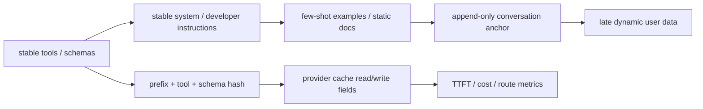

# cache-cop

A Claude Code skill for diagnosing why LLM cache reuse fails — across prompt prefixes, provider telemetry, agent tool stability, routing, and Bedrock/OpenRouter quirks.

## Why

LLM cache misses are expensive and silent. A timestamp in the system prompt, a shuffled tool schema, an OpenRouter fallback, or a new self-hosted replica turns a repeated 20k-token request back into cold prefill. The bill goes up, TTFT regresses, and the symptom looks generic. `cache-cop` gives an agent a cache-specific audit path: prefix stability, provider semantics, telemetry, routing locality, KV pressure.

## Install

```bash
tmp="$(mktemp -d)"
git clone --depth 1 https://github.com/izum286/cache-cop.git "$tmp/cache-cop"
mkdir -p ~/.claude/skills
rm -rf ~/.claude/skills/cache-cop
cp -R "$tmp/cache-cop/cache-cop" ~/.claude/skills/cache-cop
```

## Use

Ask Claude Code in any project:

> Audit this repo for prompt-cache misses, unstable prefixes, dynamic tools/schemas, routing issues, and deployment cache-locality problems.

Or run the bundled scripts directly:

```bash
python3 cache-cop/scripts/summarize_usage.py samples/usage/openai.jsonl
python3 cache-cop/scripts/lint_request.py samples/requests/chat-good.json
python3 cache-cop/scripts/diff_prefix.py samples/requests/chat-good.json samples/requests/chat-bad.json
python3 cache-cop/scripts/render_report.py \
  --usage-log samples/usage/openai.jsonl \
  --provider openai --engine "Responses API" \
  --finding "samples/usage/openai.jsonl:1 | low | openai | cold request has zero cached tokens | first request pays full prefill | warm repeated prefix before measuring steady state | confirm warm cached_tokens increase"
```

## Sample output

The final artifact is a markdown report assembled by `render_report.py` from the outputs of the other scripts. Trimmed example (`samples/snapshots/openai/report.md`):

```markdown
# Prompt-cache audit · openai (Responses API)

**Headline:** 4 requests, 67.36% cache hit, 1 finding (low). Cold request has zero cached tokens.

## Numbers

| | Value |
|---|---:|
| Records reviewed | 4 |
| Cache hit ratio | 67.36% |
| Output share | 6.92% |
| Confidence | low |

## Issues

| Source | Severity | What's wrong | How to fix | How to verify |
|---|---|---|---|---|
| samples/usage/openai.jsonl:1 | low | cold request has zero cached tokens | warm repeated prefix before measuring steady state | confirm warm cached_tokens increase |
```

## How it works

`cache-cop` is a hybrid skill: instructions in `cache-cop/SKILL.md` plus a stdlib-only Python toolkit under `cache-cop/scripts/`. The agent runs scripts during a session and uses the output as evidence.

| Script | Purpose |
|---|---|
| `scan_repo.py` | Find SDK calls and cache-related parameters across the project. |
| `lint_request.py` | Static analysis of a rendered request for volatile early content, unstable tool order, dynamic schema fields. |
| `diff_prefix.py` | Byte-level diff of two rendered request JSONs to catch prefix drift. |
| `summarize_usage.py` | Parse provider usage logs and compute cache hit ratio + output share. |
| `roi.py` | Cost-delta math from static/dynamic/output token assumptions. |
| `render_report.py` | Assemble findings into the final markdown/JSON output. |

The skill does **not** capture or proxy live traffic. Logs come from one of: provider dashboard exports, application-side middleware that dumps `response.usage`, or an existing gateway (LiteLLM / Helicone / Langfuse / OpenRouter).

Findings are tagged three ways: **confirmed** (code + telemetry), **hypotheses** (`needs validation` — code only), **not applicable** (caching ruled out by the Project Context Gate).

## Cacheable request layout



## Bring your own evidence

Good inputs for a real audit:

- Provider usage logs or billing exports with cache read/write fields.
- Rendered JSON request payloads from the hot path (Chat-style `messages` or Responses-style `input`).
- Normalized per-step agent logs: model, route, prefix hash, tools hash, token usage, latency.
- Deployment or router config when cache locality is part of the issue.

Bundled fixtures under `samples/` are demo and regression-test data — not required for a real audit.

## Audit checklist

- Prompt-cache applicability before recommending changes.
- Stable prompt prefix layout; volatile data pushed late.
- Deterministic tool/schema serialization; stable tool sets inside agent loops.
- History truncation, compaction, summarization.
- Cache-aware routing for managed and self-hosted inference.
- OpenRouter sticky routing, provider fallback, cache read/write fields.
- Bedrock cache checkpoints and read/write fields.
- Prefill vs decode latency and output-token cost share.
- KV-cache budget, eviction, deployment config.
- Provider-specific usage fields and docs freshness.
- ROI assumptions across static, dynamic, and output tokens.
- CI/smoke-test readiness for prefix drift.

## Trigger examples

<details>
<summary>OpenAI-compatible wrapper ambiguity</summary>

> Review this app for prompt-cache issues. It imports the OpenAI SDK, but `base_url` points to `https://openrouter.ai/api/v1`. We added `prompt_cache_key`, `provider.order`, and `openrouter/auto`; `cache_write_tokens` appears, but `cached_tokens` stays zero.

</details>

<details>
<summary>Claude automatic caching writes every request</summary>

> Audit our Claude layout. We added top-level `cache_control` to an 18k-token policy prompt, then append timestamp and user question as the final block. `cache_creation_input_tokens` increments every request, but `cache_read_input_tokens` stays zero.

</details>

<details>
<summary>Bedrock Converse cross-region cachePoint</summary>

> Review this Bedrock Converse request. `cachePoint` is placed after a user-specific intro, tools differ by route, `CacheWriteInputTokens` is high, `CacheReadInputTokens` is near zero, some traffic uses cross-region inference.

</details>

<details>
<summary>MCP tool registry drift</summary>

> Audit our coding agent. The MCP tool registry is queried every step, tool order changes with plugin load timing, read-only mode removes write tools, compaction rewrites the first user turn. Costs rose even though each step sends fewer tools.

</details>

<details>
<summary>High cached tokens, low savings</summary>

> Explain why this workload still costs too much. `cached_tokens` is high and TTFT improved, but responses average 4k output tokens, tool calls add seconds, TPM errors did not improve.

</details>

## Tests

```bash
python3 -m unittest tests.test_scripts
python3 tests/validate_skill.py cache-cop
```

CI runs the unittest suite, the skill structural validator, a Python syntax compile, a whitespace check, and a generated-bytecode guard. New scripts must stay stdlib-only and ship fixture-backed tests.

For a baseline-vs-with-skill evaluation harness (binary activation + rubric scoring), see [`judge/README.md`](judge/README.md).

## Provider docs drift

Provider cache behavior changes. The skill treats bundled provider references as heuristics and instructs the agent to verify official docs before claims about pricing, TTL, model support, field names, `cache-control` semantics, or routing hints.

## License

MIT.
