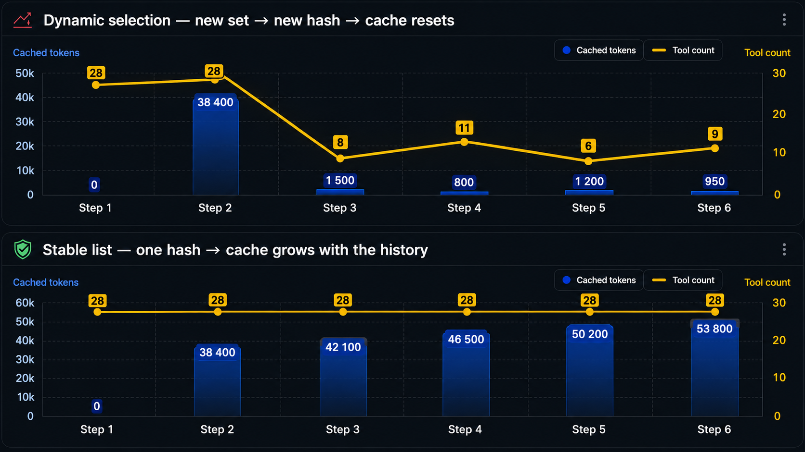
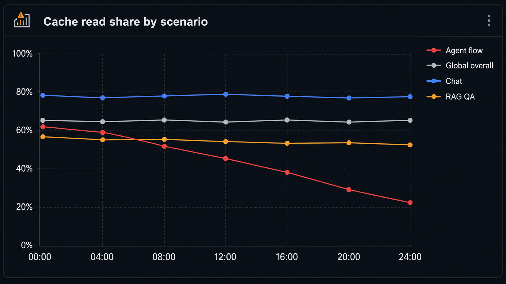
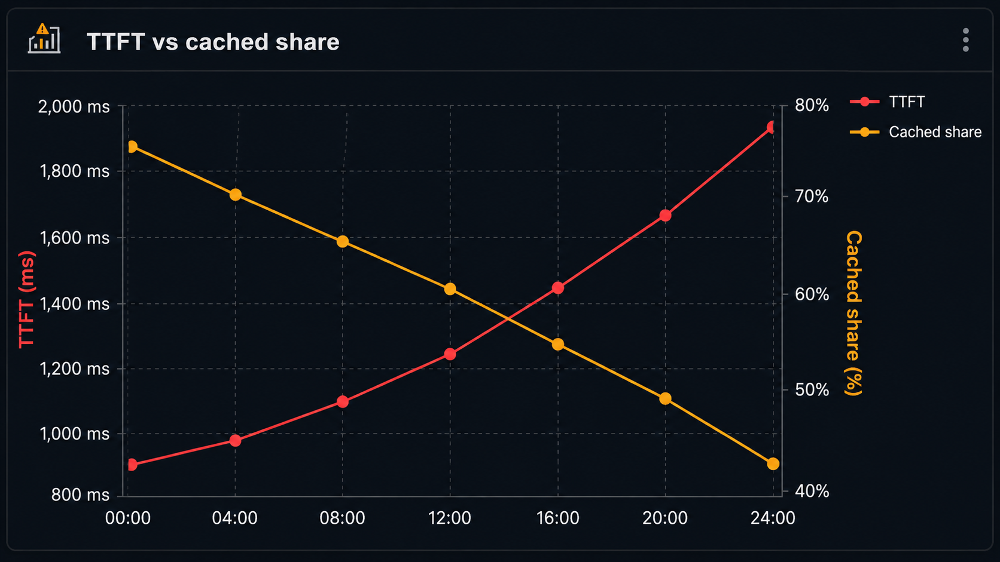
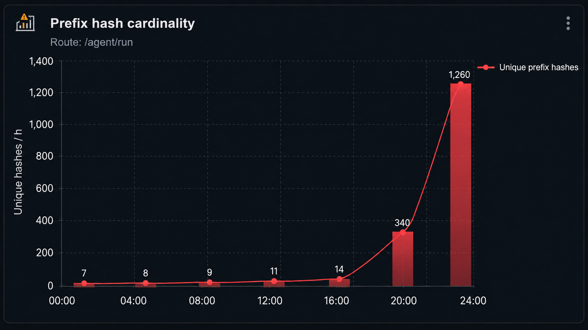
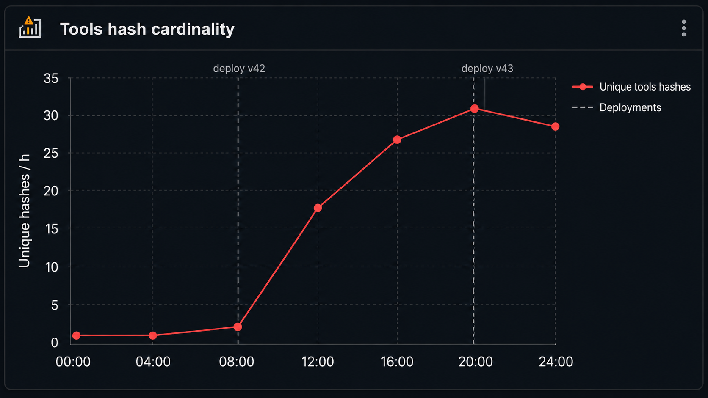
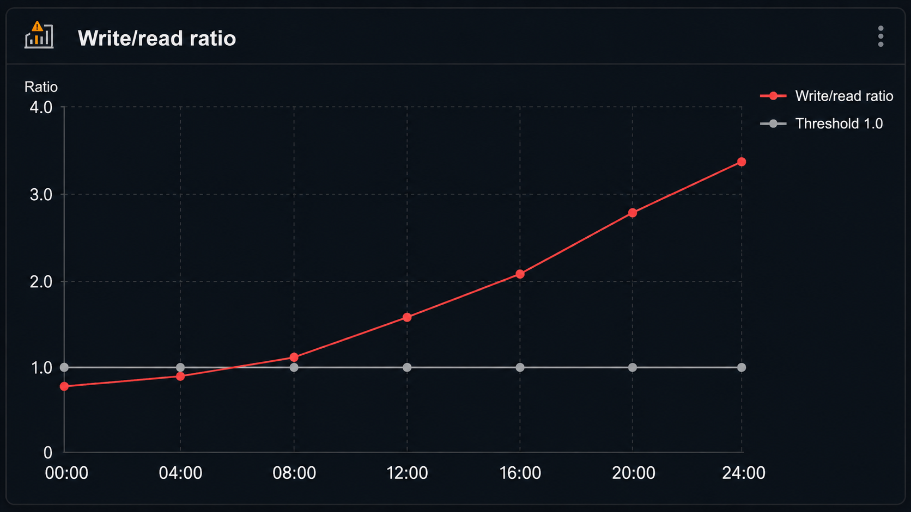
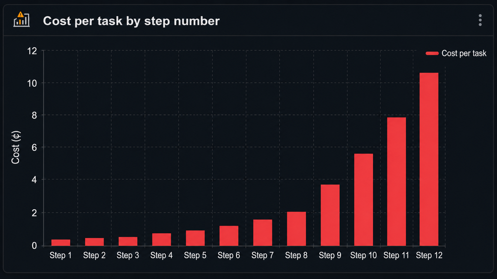

# Prompt caching in managed LLMs: the contract you keep breaking

> Instead of writing yet another AI-generated marketing hook to grab your attention, let me just drop a link to the tool I built for exactly this problem: [**cache-cop**](https://github.com/izum286/cache-cop) — a Claude Code skill that audits a repo for prompt-cache misses, unstable prefixes, dynamic tools/schemas, routing issues, and deployment cache-locality problems. If you find the article useful, it's probably useful too.

When colleagues complain that the OpenAI or Anthropic bill tripled at the same traffic, the first thing I do is ask them to take the price sheet off the table. In this domain the price sheet lies more often than it helps. It neatly lists $3 per million input tokens, and it feels like all you need to estimate cost is to multiply the numbers. In practice one team pays $300 a month for that workload, the team next door pays $1500. Same model, comparable volumes, five-fold difference.

The root of the difference is the discipline around the first few thousand tokens of every request. If those are stable from call to call, the provider pulls precomputed KV tensors from its internal cache and bills you at a reduced rate. If a timestamp floats at the start of the request, the order of tools drifts, or markdown formatting shifts, then as far as billing is concerned, every request is brand new with all consequences attached.

The mental model that works for me: prompt caching is a two-sided contract. You promise to bring repeatable prefixes; the provider promises not to recompute them from scratch. Break your side — the invoice tells the story.

This article is about managed providers: OpenAI, Anthropic, Google Gemini, DeepSeek, OpenRouter as an aggregator. Self-hosted stacks like vLLM or LMCache I'll mention as background — the level of control there is entirely different, and the engineering decisions diverge accordingly.

All prices and thresholds are reconciled against the providers' public pages as of February 25, 2026. If you're reading this later, double-check the numbers. The mechanics will still hold. (Draft — sections after "Production procedure" are still being written.)

---

## Intro

If your logs don't have fields like `cached_tokens` or `cache_read_input_tokens`, you don't actually know the cost of your LLM workload. You have a rough upper bound, that's it.

A migration to a cheaper model often ends with a higher bill. A workflow that held 90% hit rate on Anthropic with explicit breakpoints can drop to 20% when ported "as-is" to OpenAI or Gemini implicit, and the savings off the price sheet evaporate.

The overwhelming majority of expensive cache misses are not created by users — they're created by your own code around the API: a dynamic tool list, a `requestId` inside `json_schema`, `DateTime.now()` in the first line of the system prompt, different markdown rendering across services, balancing across organizations, parallel fan-out without warm-up. On code review all of this passes as reasonable changes. On the invoice it doesn't.

In agent loops the rule tightens further: tools almost always sit at the start of the cacheable context, so any change to that list invalidates the cache of the entire accumulated history below it.

Cheat sheet on tools:

- up to 10 — keep the list stable, don't overthink it;
- 10–50 — stable array plus `allowed_tools` or a policy layer;
- 50+ — `tool_search`, `defer_loading`, fixed routes, or specialized agents;
- log `prefix_hash`, tool count, `cached_tokens`, TTFT, model — always, from day one.

---

## What actually gets cached, how, and why

An LLM request decomposes into two big phases. First the model chews through the input: system, tools, history, RAG, user message. For every token, key/value tensors are computed for the attention layers — that phase is called **prefill**. Then the model generates output, which is **decode**.

Prompt caching only speeds up and discounts prefill. If twenty thousand tokens at the start of your request were already processed recently, the provider takes precomputed KV tensors and doesn't recompute them. The output is still generated from scratch.

Two important consequences fall out of this mechanic.

First — caching works best when the input is large and the output is short. Classification, extraction, routing, agent tool calls, RAG with a terse answer. All the scenarios where you primarily pay for reading.

The second consequence is less fun. If output is 80% of your bill, no prompt-caching budget will save you. It'll improve TTFT — yes. But it won't make expensive generation cheaper, and what you need to optimize is the answer length, the model, the reasoning mode, or the workflow itself.

And one more detail without which the rest won't make sense. All managed providers think in terms of **prefix reuse**. The start of the request matches — pull from cache. The first mismatched token — everything after it is recomputed in full. So block ordering matters, often far more than people expect.

Bad layout:

```text
system: base instructions + timestamp + user/company context
tools:  generated in random order
user:   question
rag:    large reusable corpus
```

Here the expensive RAG sits after the dynamic user section and never lands in the cache.

Good layout:

```text
system: stable instructions
tools:  stable sorted schemas
rag:    stable or explicitly cached
user:   timestamp, company, question, per-request payload
```

The second one isn't as semantically pretty, granted. But it's cheaper and faster, and in production that's usually enough.

---

## The math?

We don't need a mathematically elegant formulation, we need a calculator that fits in a spreadsheet and that you can run in your head on the fly.

Notation:

- `S` — repeatable static content: system prompt, tool definitions, shared RAG, policy.
- `D` — dynamic content: user query, timestamp, session state, tenant context, fresh tool result.
- `O` — output tokens.
- `h` — share of static read from cache (in logs it's more convenient to count by tokens, not by requests).
- `P_input`, `P_write`, `P_read`, `P_output` — prices for input miss, cache write, cache read, output.

Cost of a single request:

```text
cost = S * ((1 − h) * P_write + h * P_read)
     + D * P_input
     + O * P_output
```

If prices are quoted per million tokens, divide by `1_000_000` at the end.

For OpenAI, Gemini implicit, and DeepSeek you can take `P_write = P_input` — there's no separate write surcharge. For Anthropic you can't: the 5-minute write costs `1.25 × P_input`, the 1-hour write costs `2 × P_input`, and reads are `0.1 × P_input`.

For Gemini explicit caching you add storage on top:

```text
storage_cost = cached_tokens * ttl_hours * P_storage_per_MTok_hour / 1_000_000
```

In most scenarios storage is small compared to input. But if you have a large cache object and a long TTL, that line sneaks into the invoice in a noticeable way.

### Break-even

When there's no write surcharge, any cache hit beats a miss. The only question is whether the hit will happen at all.

For Anthropic with its 25% write surcharge, you need a minimum amount of reuse. The formula is simple:

```text
h > (P_write − P_input) / (P_write − P_read)
```

For 5-minute TTL:

```text
h > (1.25 − 1.00) / (1.25 − 0.10) = 21.7%
```

For 1-hour:

```text
h > (2.00 − 1.00) / (2.00 − 0.10) = 52.6%
```

Plain English: Anthropic's 5-minute cache pays for itself almost immediately. The 1-hour cache makes sense in exactly one case — when the gaps between similar requests are genuinely longer than five minutes. Enabling the 1-hour TTL "because it sounds cooler" is throwing money out the window.

---

## Finding S, D, O from real logs

Take usage data over 1,000–10,000 real requests and compute medians **per scenario**. Not one number across the whole API. Agent loop separately, document classification separately, chat separately, background extraction separately. If you average everything together, the short unique requests get mixed with the long cache-friendly ones, and you'll see nothing useful.

### OpenAI

For OpenAI we look at `cached_tokens` inside prompt details:

```ts
function openaiCacheStats(resp: any) {
  const prompt = resp.usage?.input_tokens ?? resp.usage?.prompt_tokens ?? 0;
  const cached =
    resp.usage?.input_tokens_details?.cached_tokens ??
    resp.usage?.prompt_tokens_details?.cached_tokens ??
    0;

  const output = resp.usage?.output_tokens ?? resp.usage?.completion_tokens ?? 0;
  const uncached = Math.max(prompt - cached, 0);
  const h = prompt > 0 ? cached / prompt : 0;

  return { prompt, cached, uncached, output, h };
}
```

`cached / prompt` isn't "share of requests with a hit" — it's the share of input tokens read from cache. For money, that's the one that matters.

### Anthropic

Anthropic's breakdown is more honest:

```ts
function anthropicCacheStats(message: any) {
  const read = message.usage?.cache_read_input_tokens ?? 0;
  const write = message.usage?.cache_creation_input_tokens ?? 0;
  const input = message.usage?.input_tokens ?? 0;
  const output = message.usage?.output_tokens ?? 0;

  const totalInput = read + write + input;
  const h = totalInput > 0 ? read / totalInput : 0;

  return { read, write, input, output, totalInput, h };
}
```

If `write > 0` on every request while `read = 0`, congratulations — you're paying the write surcharge for a cache nobody ever reads from. Worse than just disabling caching. A solid signal that the breakpoint is in the wrong place.

If `read = 0` and `write = 0`, first check the threshold. For Haiku 4.5 and the Opus 4.5/4.6/4.7 line the minimum is 4096 cacheable tokens. A 3500-token system prompt won't be cached, and no warning will reach you.

### Gemini

Gemini exposes `usage_metadata.cached_tokens`, but you must distinguish implicit from explicit. Implicit may give a hit, may not, and there are no guarantees on top. So for a production calculator, your logs need to store:

```text
model
cached_tokens
prompt_token_count
cache_mode = implicit | explicit
cache_name / cache_id
ttl
```

If you have an explicit cache object and the hit rate is still low, the reason is almost always that you're using the object differently than you think you are. Some dynamic content slipped into a cached block, or the TTL is shorter than the gaps in traffic.

### DeepSeek

DeepSeek logs hit/miss input tokens separately:

```text
prompt_cache_hit_tokens
prompt_cache_miss_tokens
```

These belong on the dashboard as first-class metrics. At current V4 Flash prices a single miss token is 50× more expensive than a hit token. An averaged `input_tokens` field without that breakdown is nearly useless in such an economy.

### What to compute on the sample

| Metric | Why |
|---|---|
| p50/p90 input tokens | size of the workload |
| p50/p90 output tokens | does output dominate |
| median cached token share | actual `h` |
| p10 cached token share | the degrading tail |
| cache write/read ratio | wasted writes |
| TTFT p50/p95 | cache's effect on UX |
| cost per successful task | the real economics |

The last row is the one I'd push hardest on. `cost per call` regularly lies in agent flows. One user task can decompose into 30 LLM calls, and if your optimization made the first three cheaper but the remaining 27 more expensive, the per-call chart looks great while the per-task bill grows. Finance won't applaud that enthusiasm later.

---

## Five ways to negotiate with the provider

Caching at every major provider works differently — who's responsible for prefix stability, where you can place a boundary, and what happens during routing.

| Provider | How it turns on | Strengths | Where we trip |
|---|---|---|---|
| OpenAI | automatic | no write surcharge, `prompt_cache_key`, extended retention on new models | requires an exact prefix match; any schema dynamism kills it |
| Anthropic | `cache_control`, automatic or explicit | can cache individual blocks, flexible | write surcharge, TTL, minimum threshold, 20-block lookback |
| Gemini | implicit auto, explicit manual | cheap cache reads, explicit gives a guaranteed discount | implicit is best-effort, explicit carries separate storage |
| DeepSeek | automatic, disk cache | very cheap hits, long-lived disk-based cache | hits still best-effort, prices shift quickly |
| OpenRouter | on top of providers | sticky routing, single entry point | fallback to another backend nukes the warm cache |

### OpenAI

OpenAI caches automatically for prompts ≥ 1024 tokens. The discount on cached input for flagship models is typically 10×.

The key thing here is exact prefix match. That's why OpenAI especially rewards the "stable in front, dynamic at the back" layout.

A useful knob is `prompt_cache_key`. It's a routing hint so requests with a similar prefix tend to land in the same cache locality. It is not a Redis-style cache id — don't put `sessionId` there, you'll kill sharing across users. Setting an overly broad key can create a hotspot. Granularity should match the scenario: something like `support-agent:finance:v1:account:${accountId}` usually works.

Lifetimes:

- in-memory typically 5–10 minutes idle, up to an hour at peak;
- extended retention up to 24 hours on the newer models — `gpt-5`, `gpt-5.1`, `gpt-5.2`, `gpt-5.4`, `gpt-5.5` and the codex line;
- for `gpt-5.5` and newer models in that line, 24h is already the default and in-memory isn't supported.

This changes the economics of bursty traffic. The old assumption of "five minutes and it's gone" used to be normal — now you have to budget the newer OpenAI models separately from the older ones.

### Anthropic

Anthropic's cache is turned on via `cache_control`. There are two modes. Automatic puts a single `cache_control` at the request level, and the breakpoint moves with the conversation. Explicit breakpoints let you mark specific content blocks.

Explicit is the main reason Anthropic is convenient for complex prompts. You can place separate boundaries on system, tools, a big document, and history. The prefix doesn't have to be one contiguous chunk.

You pay for that control with discipline. Anthropic's cacheable prefix order is fixed: `tools → system → messages`. Change tools — everything below counts as changed too.

Minimum thresholds as of May 2026:

- Claude Opus 4.5 / 4.6 / 4.7 — 4096 tokens;
- Claude Sonnet 4.5 / 4.6 — 1024 tokens;
- Claude Haiku 4.5 — 4096 tokens.

If a block doesn't clear the bar, the API doesn't complain. You just get zeros in `cache_creation_input_tokens` and `cache_read_input_tokens`, and the only way to know is from your own logs.

A separate trap is the 20-block lookback. If a conversation jumped too far from the previous breakpoint in one step, the system can fail to find the old cache entry. For long agent steps it can be cheaper to set several explicit breakpoints rather than one at the end.

### Gemini

With Gemini there are two distinct stories under one banner.

Implicit caching is on by default for Gemini 2.5 and newer. The docs frame it as best-effort: you can raise the odds of a hit, but you can't build a guarantee on top of it.

Explicit caching requires manually creating a cache object. More overhead, but the economics are transparent: cached content is bound to a TTL, has a storage price, and subsequent requests reference a specific object.

Minimums from the docs:

- Gemini 2.5 Flash — 1024;
- Gemini 2.5 Pro — 4096;
- Gemini 3 Pro Preview — 4096;
- Gemini 3.5 Flash — 1024.

For a production calculator I wouldn't assume 90% hit rate on Gemini implicit without actual logs. With explicit you can be more confident, but don't forget the storage line.

### DeepSeek

DeepSeek is interesting right now precisely as a counterexample. For `deepseek-v4-flash` as of February 2026, a cache hit costs `$0.005/MTok`, a cache miss `$0.20/MTok`, output `$0.40/MTok`. That's not the usual 10× discount — closer to 40×.

The cache is on automatically and built around disk-based context caching. Requests produce cache prefix units; subsequent requests can reuse the ones that match. Best-effort, not a magic global memory — but cheap.

Practical takeaway: on DeepSeek it especially hurts to skip logging `prompt_cache_hit_tokens` and `prompt_cache_miss_tokens`. The prices are so divergent that the same workload can look "nearly free" or "no idea why we suddenly pay 4×."

### OpenRouter

OpenRouter adds sticky routing on top of providers. The idea is sound: if a request already warmed up the cache at a specific backend, send the next requests in that conversation there too. Conversation is identified by the hash of the first system/developer message and the first non-system message.

The catch is that sticky is best-effort. If the backend is unavailable, overloaded, or you've set a manual provider order, the request lands elsewhere with a cold cache.

With Anthropic through OpenRouter there's a specific wrinkle: top-level automatic `cache_control` only works on direct routing to Anthropic. Bedrock and Vertex don't support that mode. Explicit per-block breakpoints are more reliable here.

For experimentation OpenRouter is convenient. For a scenario where TTFT < 1 s depends on a warm cache, I'd go direct to the provider — debugging is easier.

---

## Price reference, February 2026

This table helps plug numbers into the calculator. Quality, latency, rate limits, reasoning budget, regional pricing — none of that fits here, and you can't pick "which model do we use" by this table alone.

| Model | Input miss | Cache read | Output | Comment |
|---|---:|---:|---:|---|
| gpt-5.5 | $5.00/M | $0.50/M | $30.00/M | short-context, 24h cache default |
| gpt-5.4 | $2.50/M | $0.25/M | $15.00/M | short-context |
| gpt-5.4-mini | $0.75/M | $0.075/M | $4.50/M | cheap workhorse |
| gpt-5.4-nano | $0.20/M | $0.02/M | $1.25/M | high-volume simple tasks |
| Claude Opus 4.7 | $5.00/M | $0.50/M | $25.00/M | write $6.25/M for 5m, $10/M for 1h |
| Claude Sonnet 4.6 | $3.00/M | $0.30/M | $15.00/M | write $3.75/M for 5m, $6/M for 1h |
| Claude Haiku 4.5 | $1.00/M | $0.10/M | $5.00/M | caching minimum 4096 tokens |
| Gemini 3.1 Flash-Lite | $0.25/M | $0.025/M | $1.50/M | explicit cache storage as a separate line |
| Gemini 2.5 Flash | $0.30/M | $0.03/M | $2.50/M | explicit + implicit |
| Gemini 2.5 Flash-Lite | $0.10/M | $0.01/M | $0.40/M | the cheapest Gemini tier |
| DeepSeek V4 Flash | $0.20/M | $0.005/M | $0.40/M | disk cache, automatic |
| DeepSeek V4 Pro | $0.60/M | $0.012/M | $1.20/M | disk cache, automatic |

Under the hood:

- OpenAI's flagships have long-context pricing that's higher than short-context;
- Anthropic's writes cost more than ordinary input;
- Gemini explicit has a separate storage price per token-hour;
- every platform carries its own platform/region/batch/flex/priority footnotes.

So treat the table as a reference for the calculator, not a decision engine.

---

## Three stories where intuition lies

### One model, different bills

Take a RAG/agent-like request:

- `S = 10,000` tokens of static content;
- `D = 200` tokens of dynamic;
- `O = 300` output;
- 2,000 requests per day;
- model — DeepSeek V4 Flash.

| Hit rate on static | $/day | What's usually behind the number |
|---:|---:|---|
| 30% | $2.20 | timestamp, schema, or tools break the start |
| 60% | $1.38 | part of the prefix is stable, part is fragmented |
| 90% | $0.55 | normal prefix discipline |
| 98% | $0.33 | almost the entire shared block lives in cache |

Same model. Same tokens. Only the hit rate changes. On DeepSeek the effect is especially dramatic thanks to the 50× gap between miss and hit; on OpenAI or Anthropic the curve is softer, but the direction holds.

### A short output makes the input dominant

A different workload:

- `S = 10,000`, `D = 200`, `O = 100`;
- `h = 90%`;
- 1,000 requests.

| Model | Cost per 1,000 requests |
|---|---:|
| gpt-5.5 | $13.50 |
| gpt-5.4 | $6.75 |
| gpt-5.4-mini | $2.02 |
| Claude Opus 4.7 | $14.25 |
| Claude Sonnet 4.6 | $8.55 |
| Claude Haiku 4.5 | $2.85 |
| Gemini 3.1 Flash-Lite | $0.68 |
| Gemini 2.5 Flash | $0.88 |
| Gemini 2.5 Flash-Lite | $0.25 |
| DeepSeek V4 Flash | $0.22 |

The table shows cost, not quality. Its main lesson: with a short answer, the winner is almost always decided by the price of repeatedly reading a long prompt. A 100-token output is the last thing you'll feel in your wallet.

Push the output up to 4,000 tokens and the picture flips. Output dominates again, the cache only helps with TTFT, and for the budget you have to look at generation prices and the reasoning mode.

### Big context turns TTL into a product parameter

50,000 tokens of static. One warm-up, one read.

| Model | Warm-up (miss) 50k | Read from cache 50k |
|---|---:|---:|
| gpt-5.5 | $0.2500 | $0.0250 |
| gpt-5.4 | $0.1250 | $0.0125 |
| Claude Opus 4.7 | $0.3125 | $0.0250 |
| Claude Sonnet 4.6 | $0.1875 | $0.0150 |
| Gemini 3.1 Flash-Lite | $0.0125 | $0.0013 |
| DeepSeek V4 Flash | $0.0070 | $0.0001 |

For a single request the gap looks negligible. Across thousands of requests with daily re-warming it becomes a line on the budget, and not a pleasant one.

Far more important is TTFT. The user doesn't wait on "cost," they wait on the first token. A full prefill on 50k can turn a live UI into a sluggish one, even if the dollar damage is bearable. If the product promises "a fast agentic UX over big context," prompt caching becomes part of the product requirement, not an optimization tacked on top.

### When the cache is the wrong lever

There's the reverse mistake too. People see a 10× discount and start treating it as a cure-all.

It isn't.

For a 700-input-token, 2,000-output-token request, prompt caching contributes almost nothing. Technically the provider will cache it, but the savings are roughly zero. What plays here is answer length, model choice, reasoning budget, streaming, batch/flex pricing, retry count, response format — anything but the cache.

If the model is heavy on reasoning and produces a lot of hidden or explicit reasoning tokens, the input-side cache will make TTFT nicer but won't shift the economics. The bill is set by generation-side pricing.

If almost all your requests are unique (the user uploads a fresh document and asks one question each time), the cache isn't magic either. The shared system/tools layer is still cacheable, the document is not. What you need here is chunking, preprocessing, embeddings, summarization before the LLM, or a smaller model for the first pass.

And one more situation — the hit rate is already 85–95% and latency is still bad. Polishing the gaps in the prompt further is pointless. Look at provider queueing, the network, streaming, tool latency, post-processing, the database. The cache addresses prefill, not the rest of the backend.

The healthy conclusion: cache discipline is baseline hygiene for long, repeatable prompts. It is not a universal performance hammer. First you need to know where your cost actually lives.

---

## Why "migrate to the cheaper model" easily ends in the red

A scenario I see regularly.

The system ran on Anthropic with explicit breakpoints. Hit rate sat at 85–95%. Someone found a model that's cheaper on input/output. The prompt was ported "as-is." New hit rate dropped to 35–50%. The bill didn't fall — sometimes it grew.

This isn't a provider bug and it isn't magic. Each provider has its own caching contract. Anthropic lets you place a breakpoint on a RAG block even when another structure sits in front of it. OpenAI wants a stable prefix. Gemini implicit may or may not fire. DeepSeek persists prefix units by its own rules. OpenRouter can route the request to a different backend.

Before migration you compare not two price sheets, but two effective costs. The price sheet says:

```text
new_price < old_price
```

Reality says:

```text
old_effective_cost(real old hit rate)
vs
new_effective_cost(conservative new hit rate)
```

I'd hold the conservative hit rate on the new provider around 40–50% — until logs prove otherwise. If after re-laying out the prompt and warming up you got 80–90%, great. That's an engineering result, though, not a property of the price sheet.

A separate tax is observability. The old API gave you `cache_read_input_tokens` on every response; if the new one says nothing about `cached_tokens` — or returns it without a clear hit/miss breakdown — you've gone blind in exactly the place where precision matters: you can't see your hit rate, and without that, the whole "effective cost" comparison above becomes guesswork.

### How to migrate without lying to yourself

I do it in four passes.

**Take a baseline.** Not "roughly how much the model costs" — actual distributions: input p50/p90, output p50/p90, cache read share p50/p10, TTFT p50/p95, cost per task. Per scenario, not globally. Without that picture migration is guesswork.

**Re-lay the prompt for the new contract.** If the target provider is OpenAI-style, push dynamic content behind the shared block. If it's Anthropic, plan where explicit breakpoints will go. If it's Gemini explicit, decide which cache object gets created, who owns the TTL, how versioning invalidates it. If it's OpenRouter, accept that fallback to another backend happens, and bake that into the SLA.

Pay particular attention to tools, structured output schemas, RAG placement, user/tenant context, system prompt versioning, multimodal input parameters, and the history compaction strategy. Each of these can quietly break the cache on the new stack.

**Run a replay.** Take real anonymized requests and push them through the new provider path. Compare not just answer quality, but cached share, TTFT, cost per task before/after. If the share dropped from 90% to 45%, I don't argue with the price table — I go fix the prompt layout.

**Turn on a shadow dashboard.** The first days after release you need alerts not only on errors and latency but on cache regression. A drop in agent hit rate is the same kind of product incident as p95 latency growth. The money just burns more quietly.

---

## How we break the hit rate ourselves

Almost all breakages fall into three classes. The start of the request stopped matching; the request landed in a cold segment; the cache didn't survive until the next access. I'll walk through each one.

### Class one: the start of the request is no longer the same

Most obvious one:

```ts
const system = `
Now: ${new Date().toISOString()}
Tenant: ${tenant.name}

${BASE_SYSTEM_PROMPT}
`;
```

This will pass code review. "The model needs to know the date." It does, agreed. But not in the first line of the system prompt.

Do this:

```ts
const system = BASE_SYSTEM_PROMPT;

const userContext = canonicalJson({
  now: new Date().toISOString(),
  tenant: tenant.name,
});

const messages = [
  { role: 'system', content: system },
  { role: 'user', content: `[context=${userContext}]\n${query}` },
];
```

Date is there, tenant is there. The expensive shared prefix stayed shared, and the cache lives.

The same disease in less obvious places:

- one service emits `\n`, another `\n\n`;
- the SDK serializes JSON keys in a different order;
- image input is sometimes `detail: "low"`, sometimes `detail: "high"`;
- a URL is signed with a transient query parameter;
- `response_format` contains a `requestId`;
- tools are assembled from a registry without sorting;
- a schema definition contains dynamic fields.

### Class two: the request landed in a different segment

Even a perfectly stable prefix doesn't help if the request lands on someone else's backend.

A typical gateway I regularly see in open-source repos:

```ts
class Gateway {
  send(req: unknown) {
    const client = this.chooseRandomClient();
    return client.responses.create(req as any);
  }
}
```

If `clients` belong to different OpenAI organizations, the cache isn't shared between them. If it's OpenRouter with different providers, same story. If you manually change `prompt_cache_key` on every request, you're shredding traffic by hand.

A more sensible pattern:

```ts
const promptCacheKey = `support-agent:finance:v1:account:${account.cacheGroup}`;

await client.responses.create({
  model,
  input,
  tools,
  prompt_cache_key: promptCacheKey,
});
```

The key shouldn't be `sessionId` if you want sharing across similar sessions. And it shouldn't be one-for-all if that creates a hotspot.

### Class three: the cache didn't have time, or didn't survive

Parallel fan-out — a classic, especially for people new to agents:

```ts
await Promise.all(
  questions.map(q => callLLM(sharedPrefix, q)),
);
```
Engineer's logic (and it's correct in the context of "classical" development): the first request warms the cache, the rest pick it up. Reality: all ten start simultaneously, the cache entry doesn't exist yet, and you pay for ten full prefills in a row.

Fixed by a one-line warm-up:
```ts
await callLLM(sharedPrefix, warmupQuestion);

await Promise.all(
  questions.map(q => callLLM(sharedPrefix, q)),
);
```

On Anthropic this is especially important — the cache entry becomes available after the first response starts. Want hits on a parallel batch? Wait for the first response, then fan out.

The second variant is subtler. Traffic is rare: the prefix is used once every 20 minutes, and the cache lives for five. Hit rate will be poor even with a perfectly assembled prompt, and the problem isn't in the code.

Options:

- 1-hour TTL on Anthropic, if the gaps fit within an hour;
- extended retention on OpenAI's newer models;
- explicit Gemini cache with the right TTL;
- DeepSeek disk cache for genuinely irregular traffic — its disk cache already lives nearly 24 hours;
- or accept that the scenario isn't cache-friendly and budget without it.

### What it looks like in real life

Take an internal support agent. Before release:

```text
input p50:        24k
cached share p50: 88%
TTFT p50:         620 ms
cost/task:        $0.018
```

Three changes made it into the release. `Today is ${date}` was added to the system prompt. The tool registry moved to a plugin loader, and tool order became dependent on the filesystem. The gateway started distributing requests across two API keys for "reliability." Again — absolutely legitimate and correct fixes in "classical" terms, but there's a trick here:

After release:
```text
input p50:        24.5k
cached share p50: 12%
TTFT p50:         2.1 s
cost/task:        $0.061
```
Input tokens barely changed. Output didn't either. No errors in the logs. The model answers correctly. Users complain the system "got dumber." A week later finance asks why inference grew 3.4×. I've been asked this.

How to debug it:

1. Look at `prefix_hash`. If it jumps between adjacent requests in the same scenario, the cause is prompt assembly.
2. Pin the system date — move it into user context. Verify.
3. Sort tools by name, switch to canonical JSON. Verify.
4. If the hash is stable and cached share is still low, look at route, backend, organization id.
5. Turn off round-robin between different org/project pairs. Verify.
6. If the problem is only on batch fan-out — add a warm-up.

It's important to recognize that such incidents rarely get fixed by "one big rewrite." Usually there are 2–3 small breakages, each chipping off 20–40% of the hit rate. Together they look like a complete cache failure and it's unclear where to start.

---

## Agents: where intuition lies hardest

Now the interesting part.
An agent has dozens of tools. The first instinct is to pick the relevant ones at each step, five to seven of them. The prompt is shorter, the model is less confused, input is cheaper.
On a single request that actually works, except an agent is NEVER a single request. That's the whole point of being an agent.

Suppose the agent runs 20 steps:

```
User          Assistant         Tool
 |                |               |
 |  [system + tool definitions]   |
 |                |               |
 |   user message |               |
 |--------------->|               |
 |                |  tool_call    |
 |                |-------------->|
 |                |  tool result  |
 |                |<--------------|
 |                |  tool_call    |
 |                |-------------->|
 |                |  tool result  |
 |                |<--------------|
 |                |     ...       |
```

By the late steps the history is enormous. Tools sit at the very start of the request. Change tools — the start changes, and the entire accumulated history below it stops being a cache hit.

Logs of that strategy:



There are physically more tokens. Fewer dollars on the invoice, because the old context stopped getting recomputed.
A back-of-envelope for 20 late steps, each carrying 50k input and 80 output:

| Model | 20 miss-steps | 20 hit-steps | Savings |
|---|---:|---:|---:|
| gpt-5.4 | $2.52 | $0.27 | $2.25 |
| Claude Sonnet 4.6 | $3.02 | $0.32 | $2.70 |
| Gemini 3.1 Flash-Lite | $0.25 | $0.03 | $0.22 |
| DeepSeek V4 Flash | $0.14 | ~$0.00 | $0.14 |

Bearable on a single session. On ten thousand sessions a day it's no longer a micro-optimization.

### What to do about tools

It's important not to slide into dogma here. "Always stuff everything into context" is just as bad an answer as "always filter."

Separate two distinct tasks. One — how tool descriptions land in the cacheable prompt. Two — which tools are allowed for the model at the current step.

Bad:

```ts
{
  tools: selectToolsForThisStep(allTools, state),
  messages,
}
```

Good, when the provider supports it:

```ts
{
  tools: stableSortedTools,
  tool_choice: {
    type: 'allowed_tools',
    mode: 'auto',
    tools: allowedForThisStep,
  },
  messages,
}
```

In your own inference you can do masking or constrained decoding — Manus demonstrates this trick. Unavailable actions are masked at selection time rather than cut out of context.

For managed APIs the equivalents are:
- OpenAI — `allowed_tools`, `tool_search`, a stable tools array;
- Anthropic — Tool Search and `defer_loading`, explicit breakpoints;
- Gemini — fixed tool sets per route, when a convenient policy layer isn't on hand;
- OpenRouter — be careful with provider routing, or stable tools won't save you.

A working cheat sheet:

| Size of the tool list | Approach |
|---:|---|
| 1–10 | keep them all, sort, don't overthink |
| 10–50 | stable array plus allowed/policy layer |
| 50+ | tool search, deferred loading, route-specific agents |
| different domains | semantic router before the agent loop |
| prototype | dynamic selection is fine, but log hit rate from day one |

The main question is not "how nicely the tool list reads in the prompt," but how much a cache miss on a late step of your scenario costs.

### Manus, Claude Code, research

Manus has a formulation in their context engineering article that I'd hang in any agent runtime: mask, don't cut. The point is simple — tool availability and the text of the prompt live in different layers. Availability can change as often as you like, the key is that the tools block text stays the same.

For Manus this is resolved at decoding time: action names are picked so that groups of tools can be limited via prefix masking. In managed APIs we usually can't reach into logits, but we can repeat the pattern:

- a stable tools array;
- `allowed_tools` / `tool_choice`;
- deferred loading;
- tool search;
- route-specific tool sets.

Claude Code is a public example of the same discipline. The system/tool layer is warmed up early and reused, while modes like plan or read-only are expressed through state and messages — without rewriting tools.

The "Don't Break the Cache" paper puts numbers under that intuition. On long agentic tasks the main savings don't come from making one request shorter — they come from the growing history no longer being recomputed from scratch. Strategies that look strange on a single request turn out to be cheaper across the whole workflow.

The short version: optimize the trajectory, not a single request. For an agent, the cost of step 17 depends on what you did on steps 1–16. A regular request-level profiler won't show you that.

---

## Agent history: what to keep in the prompt, what to push out

Even with stable tools, an agent quickly inflates context. Tool results can be huge: HTML, JSON, stack traces, search results, file contents.

The naive move is to cache the whole conversation as-is.

A better mental structure:

```text
anchor:  system + tools + policy + first stable messages
middle:  compacted observations
tail:    last steps without losses
external: files, URLs, IDs, paths
```

Manus articulates the idea well with file system as context. A large observation can be removed from the prompt as long as you leave a recoverable pointer. URL instead of HTML. Path instead of the file. ID instead of the raw payload. If the agent can reopen the source at any time, that's not lossy summarization.

The escalation ladder for cleaning history runs from soft to hard:

```text
raw observation → compaction → extractive notes → summarization
```

Summarization is last because it's lossy. It can drop a detail that resurfaces 12 steps later. It can rewrite an early prefix and break the cache. It can produce the false sense of "we optimized context" while in reality you just lost information.

If you do need to clean up — don't touch the anchor. Compact the middle. Keep the tail fresh. And log which compaction version dropped the hit rate, or you'll never find the regression.

---

## What to log

Without observability, prompt caching turns into religion.

Minimum per LLM call:

```text
provider
model
input_tokens
output_tokens
cached_tokens / cache_read_input_tokens / prompt_cache_hit_tokens
cache_write_tokens / cache_creation_input_tokens / prompt_cache_miss_tokens
ttft_ms
prefix_hash
tools_count
prompt_cache_key
route/provider_backend
```

A guardrail on the prefix — a simple hash on our side:

```ts
import { createHash } from 'node:crypto';
import canonicalize from 'canonicalize';

function prefixHash(system: unknown, tools: { name?: string }[]) {
  const sorted = [...tools].sort((a, b) => (a.name ?? '').localeCompare(b.name ?? ''));
  const stable = canonicalize({ system, tools: sorted }) ?? '';
  return createHash('sha256').update(stable).digest('hex').slice(0, 12);
}
```

It doesn't mimic the provider's tokenization exactly, but it's our fire alarm.

How to read the combinations:

- `prefix_hash` jumps, hit rate dropped — we assemble the prompt sloppily;
- `prefix_hash` is stable, hit rate dropped — look at routing, TTL, concurrency, or provider behavior;
- `cached_tokens` is high, the bill is still big — output or reasoning dominates;
- TTFT grew, tokens didn't change — likely a cache miss or a route switch.

For agents it's worth adding:

```text
step
tool_names_hash
allowed_tools_hash
history_blocks_count
compaction_version
```

Without those fields you can't distinguish "a clever tools optimization that turned every step into a cold start" from a real problem.

### Red graphs on the dashboard

A few charts I consider effectively mandatory.

**Cache read share per scenario, not globally.** The global line can look stable purely thanks to cheap chat traffic masking degradation in an expensive agent flow. The per-task breakdown shows the real picture.



**TTFT vs cached share.** If TTFT grows inversely with cache share, the cause is almost found. If cache share is stable and TTFT still climbs, look at provider latency, queueing, reasoning, streaming output.



**Prefix hash cardinality.** For one stable scenario the cardinality should be low. If thousands of distinct prefix hashes pile up on one route within an hour, dynamic content slipped into the start of the request.



**Tools hash cardinality.** Especially for agents. If the tools hash changes more often than the deploy version, you have either dynamic tool selection or non-deterministic serialization.



**Write/read ratio.** Anthropic-specific. Lots of writes and few reads — you're paying for warm-up that doesn't pay back.



**Cost per task by step number.** Gold for agents. If steps 1–3 are cheap and after step eight the cost explodes — the problem is almost always in history, compaction, or tools.



---

## Production procedure

**Prompt layout**

- Static at the start, dynamic at the end or in metadata.
- The system prompt contains no timestamp, session id, request id, or tenant-specific minutiae.
- The RAG block sits before the user query, if you want prefix caching on an OpenAI-style provider.
- On Anthropic, the breakpoint is placed on the last actually-stable block, not on a block with a timestamp.

**Tools and schema**

- Tools are sorted deterministically.
- JSON is serialized canonically.
- `response_format` is free of runtime values.
- Tool descriptions contain no versions, dates, or generated ids.
- Tool availability per agent step changes through a policy layer, not by rebuilding the array.

**Routing**

- One organization/project for traffic that should share a cache.
- `prompt_cache_key` ≠ `sessionId`, when you want cross-session reuse.
- OpenRouter provider order doesn't break sticky routing.
- Parallel batches have a warm-up.

**TTL**

- The pause between repeat hits on the same prefix is measured.
- 5 minutes — for dense traffic.
- 1-hour, 24h, explicit TTLs are matched to real gaps.
- On Anthropic, 1-hour TTL is verified against break-even.

**Monitoring**

- Hit rate on the dashboard is broken down by scenario, not averaged across the API.
- TTFT is viewed separately from total latency.
- There's an alert on cache read share drops.
- Release annotations exist: you can see which deploy moved the hit rate.
- CI or a synthetic test runs 3–5 agent steps and verifies that the cache builds up.

---


_FAQ, Wrap-up, and References — coming in the next pass._
